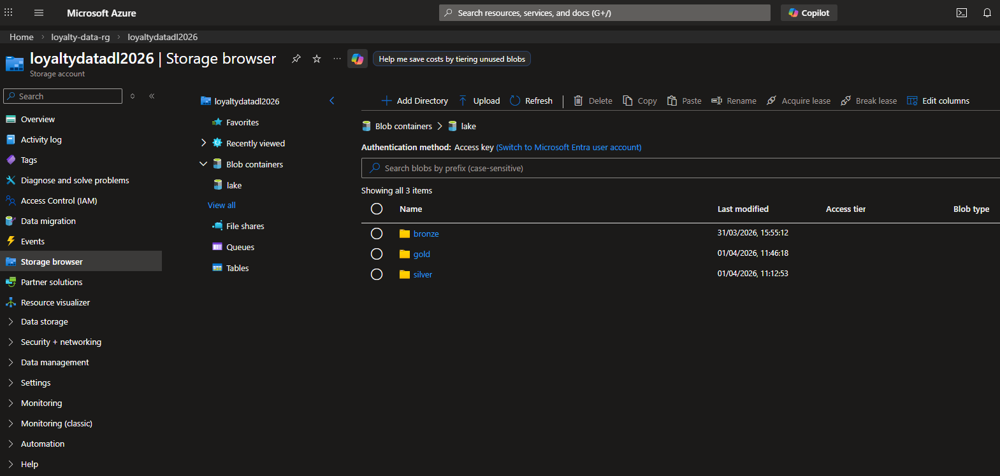
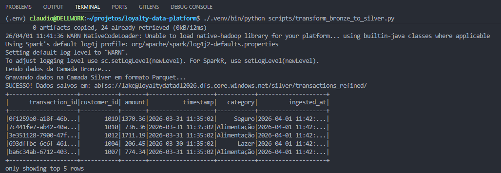
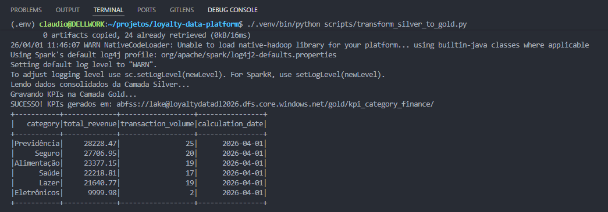

# 🛡️ Plataforma de Fidelidade & Detecção de Fraude 

## 📋 Escopo do Projeto
Este projeto simula um ecossistema financeiro onde transações diárias de seguros, previdência e serviços bancários são processadas para alimentar um motor de recompensas. O objetivo principal é demonstrar a construção de pipelines robustos que garantam a integridade dos dados e a segurança do ecossistema através de análises de fraude e arquitetura de dados moderna.

### Objetivos Principais:
* **Ingestão Batch:** Processamento diário de grandes volumes de arquivos transacionais via PySpark.
* **Detecção de Fraude:** Implementação de camadas analíticas para identificar comportamentos anômalos (ex: deslocamento impossível ou inconsistência geográfica).
* **Arquitetura Medallion:** Enriquecimento de dados brutos (**Bronze**) para tabelas analíticas (**Silver**) e agregadores de negócio (**Gold**) utilizando o formato **Parquet**.
* **Infraestrutura como Código (IaC):** Provisionamento e automação utilizando **Terraform** no ecossistema Azure.

## 🏢 Contexto de Negócio
O sistema atua em três frentes principais:
1. **Seguros e Previdência:** Ingestão de aportes e pagamentos de prêmios.
2. **Banking & Fidelidade:** Conversão de transações de cartão e conta corrente em pontos de recompensa.
3. **Segurança Operacional:** Filtro de validação para garantir que pontos não sejam atribuídos a transações fraudulentas.

## 💾 Arquitetura de Dados (Data Sources)
O projeto consome dados sintéticos gerados para simular um ambiente de produção real:
1. **Banking Transactions (CSV):** Dados transacionais brutos contendo `tx_id`, `tx_amount`, `tx_datetime`, `tx_category`, `location_city`, `ip_address` e `device_id`.
2. **Customer Profiles (JSON):** Dados de perfil de cliente e segmentação de produtos (Seguros/Previdência), cruciais para as regras de negócio de fidelidade.

### 🛡️ Camada de Segurança e Fraude
O motor de processamento (Spark) aplica regras baseadas no canal de origem:
* **Fraude Geográfica (Física):** Validação de "deslocamento impossível" entre estabelecimentos físicos.
* **Fraude de Dispositivo (Digital):** Identificação de acessos suspeitos via IP ou `device_id` (*Account Takeover*).
* **Resiliência de Schema:** O pipeline Silver normaliza campos de geolocalização (`latitude`/`longitude`) como `Double(null)` quando ausentes na origem, garantindo que o motor de fraude na camada Gold não sofra interrupções por incompatibilidade de schema.

## 🏗️ Infraestrutura e Camadas (Data Lake ADLS Gen2)
A infraestrutura é organizada em camadas de maturidade no Azure Data Lake Storage:

* **🟤 Bronze (Raw):** Armazenamento dos arquivos brutos (CSV/JSON) exatamente como chegam da origem.
* **⚪ Silver (Refined):** Dados limpos, com tipos convertidos (`Double`, `Timestamp`), saneamento de nulos e padronização de moedas. Armazenado em **Parquet**.
* **🟡 Gold (Business):** Tabelas agregadas e otimizadas para consumo. Exemplo: KPI de faturamento e volume de transações por categoria (`kpi_category_finance`).



## ⚙️ Orquestração e Ambiente Local (Centralized Airflow)
Para suportar o ecossistema Spark no WSL2, utilizamos uma infraestrutura de containers customizada:
* **Dockerfile Customizado:** Imagem base `apache/airflow:2.10.1` com **JRE 17** e PySpark.
* **Gestão de Permissões (Docker Fix):** Ajuste de volumes para garantir escrita do Spark no host via UID `50000` (usuário airflow).
* **Comando de Reparo de IO:** ```bash
docker exec -u 0 -it <container_id> chown -R 50000:0 /opt/airflow/data

## 📁 Status do Pipeline de Dados
- [x] **Infraestrutura:** Provisionada via Terraform (Azure ADLS Gen2).
- [x] **Ambiente Local:** Dockerizado com Java/Spark integrado ao Airflow.
- [x] **Ingestão (Bronze):** Dados brutos ingeridos com sucesso.
- [x] **Transformação (Silver):** Pipeline PySpark concluído (Saneamento e Tipagem).
- [x] **Modelagem (Gold):** Geração de KPIs financeiros consolidada.
- [x] **Data Quality:** Implementação de checks automáticos de Schema, Nulos e Duplicados.
- [x] **Orquestração:** DAG `pipeline_loyalty_medallion` com tratamento de erros.
- [ ] **Visualização:** Dashboard Streamlit integrado ao ADLS Gen2 (Em progresso).

## 📊 Visualização e Qualidade
O projeto utiliza **Great Expectations** (conceitualmente) e scripts Spark para garantir a integridade. A visualização é feita via **Streamlit**, consumindo diretamente ficheiros Parquet da camada Gold, permitindo uma análise executiva em tempo real.

## 🚀 Como Executar
Para processar as camadas do Data Lake localmente apontando para o Azure:

```bash
# Refino: Bronze -> Silver
./.venv/bin/python scripts/transform_bronze_to_silver.py
```


```
# Agregação: Silver -> Gold
./.venv/bin/python scripts/transform_silver_to_gold.py
```


# 🔄 Via Airflow (Orquestrado)
## Construir a imagem customizada (Java + Spark)
```docker compose build```

## Iniciar os containers
```docker compose up -d```

#### Acesse a UI em http://localhost:8081 para disparar a DAG.


## 🛡️ Detalhamento: Motor de Detecção de Fraude (Spark)
O pipeline agora processa regras de segurança em tempo real sobre a camada **Silver**, identificando padrões suspeitos antes da consolidação na **Gold**:

* **Velocidade de Deslocamento (Impossible Travel):** Script PySpark que calcula a distância entre a transação atual e a anterior do mesmo `customer_id`. Utilizando a fórmula de Haversine, se a velocidade necessária para o deslocamento for superior a **800km/h**, a transação é marcada com a flag `is_fraud = True`.
* **Divergência de Device ID:** Cruzamento entre o `device_id` da transação e a lista de dispositivos confiáveis no `Customer Profiles`. IPs de regiões não mapeadas ou dispositivos novos disparam alertas de criticidade alta.

---

## 🏗️ Infraestrutura como Código (Terraform)
A pasta `/infra` contém a definição da stack Azure, permitindo o provisionamento do ambiente de forma declarativa e segura:

* **`storage.tf`:** Configura o **Azure Data Lake Storage Gen2 (ADLS)**, criando automaticamente os containers `bronze`, `silver` e `gold`.
* **`storage.tf`:** Configura o **Azure Data Lake Storage Gen2 (ADLS)** com containers bronze, silver e gold.
* **`main.tf` & variables.tf:** Gestão de provedores e regiões (ex: East US).

> **Fluxo de Deploy da Infra:**
> ```bash
> cd infra
> terraform init
> terraform plan
> terraform apply -auto-approve
> ```

---

## 🧪 Data Quality & Observabilidade
Para garantir que o Dashboard reflita a realidade, implementamos travas de qualidade (Data Contracts) em cada etapa:
* **Schema Validation:** Garantia de que os campos mandatórios como `tx_id` e `amount` nunca sejam nulos.
* **Unicidade:** Remoção de duplicidade de registros na camada Silver para evitar inflação indevida de KPIs financeiros.
* **Permissões de Escrita:** Automação de chown nos volumes de dados para evitar falhas de Mkdirs no ambiente de desenvolvimento.

---

# 🏆 Camada Gold: Detecção de Fraude (Fraud Detection)

Esta camada representa o estágio final de processamento do pipeline **Loyalty Data Platform**. Aqui, os dados refinados da Silver são submetidos a regras de negócio geoespaciais e temporais para identificação de comportamentos suspeitos.

## 🏗️ Arquitetura do Processo
O processamento é realizado via **PySpark** e orquestrado pelo **Apache Airflow**. O motor de cálculo utiliza funções de janela (Window Functions) para comparar transações sequenciais do mesmo cliente.

### 📐 Métricas Calculadas
1. **Distância Haversine**: Cálculo da curvatura da Terra entre as coordenadas (Lat/Log) da transação atual e da anterior.
2. **Time Delta**: Diferença em segundos entre o timestamp de transações consecutivas.
3. **Velocidade Relativa**: Razão entre distância e tempo para identificar deslocamentos fisicamente impossíveis.

## 🛠️ Regras de Detecção (Business Rules)
| Regra | Lógica | Status de Teste |
| :--- | :--- | :--- |
| **IMPOSSIBLE_TRAVEL** | Distância > 5km entre transações com tempo positivo. | Ativo (Regra Flexível) |
| **HIGH_VELOCITY** | Intervalo entre transações < 24 horas (86400s). | Ativo (Regra Flexível) |

> **Nota:** As regras acima foram ajustadas para o ambiente de homologação para garantir a volumetria de dados no Dashboard.

## 📂 Estrutura de Saída (Azure Data Lake Storage Gen2)
Os dados são persistidos no container `lake` nos seguintes caminhos:

* **Audit Trail:** `gold/fraud_alerts/` (Contém o dump completo com flags de erro).
* **BI Serving:** `gold/dashboard_fraud_metrics/` (Arquivo flat otimizado para o Databricks SQL).

### Schema da Tabela de BI
| Coluna | Tipo | Descrição |
| :--- | :--- | :--- |
| `customer_id` | String | ID único do cliente. |
| `transaction_date` | Timestamp | Data/Hora do evento. |
| `amount` | Double | Valor da transação. |
| `distancia_km` | Double | Distância calculada (km). |
| `tempo_minutos` | Double | Delta de tempo em minutos. |
| `fraud_reason` | String | Categoria do alerta detectado. |

## 📊 Integração Databricks SQL
Para visualizar os dados no Databricks, utilize a View configurada:

```sql
CREATE OR REPLACE TEMPORARY VIEW v_fraud_alerts
USING parquet
OPTIONS (
  path "abfss://lake@loyaltydatadl2026.dfs.core.windows.net/gold/dashboard_fraud_metrics/"
);
```

## 🔐 Segurança e Governança de Dados

### Observação sobre Integração Databricks ↔ ADLS Gen2
> **Nota de Arquitetura:** Durante a fase de validação técnica deste pipeline, a conectividade entre o **Databricks Serverless SQL Warehouse** e o **Azure Data Lake Storage (ADLS Gen2)** foi realizada via passagem direta de credenciais no escopo da View. 

**Limitação Técnica Identificada:** Atualmente, o ambiente *Serverless SQL* apresenta restrições na execução de comandos `dbutils.secrets.get()` diretamente em células SQL. Para a evolução deste projeto (Ambiente de Produção), as seguintes melhorias de segurança são recomendadas:

1. **Unity Catalog (External Locations):** Configurar o acesso via *Service Principal* diretamente no catálogo, eliminando a necessidade de qualquer chave no código do Notebook.
2. **All-Purpose Clusters:** Utilizar clusters de propósito geral caso seja mandatório o uso de *Secret Scopes* com Python para a montagem de volumes.
3. **IAM Role Injection:** Atribuição de permissão "Storage Blob Data Contributor" à identidade gerenciada do Databricks.

### 🚀 Configuração de Mount Point (Git-Safe)
No repositório, o código de integração é representado com *placeholders* para proteção de infraestrutura:

```sql
-- Template de conexão para Databricks SQL
CREATE OR REPLACE TEMPORARY VIEW v_fraud_alerts
USING parquet
OPTIONS (
  path "abfss://<CONTAINER>@<STORAGE_ACCOUNT>.dfs.core.windows.net/gold/dashboard_fraud_metrics/",
  "fs.azure.account.key.<STORAGE_ACCOUNT>.dfs.core.windows.net" = "${AZURE_STORAGE_KEY_SECRET}" 
);